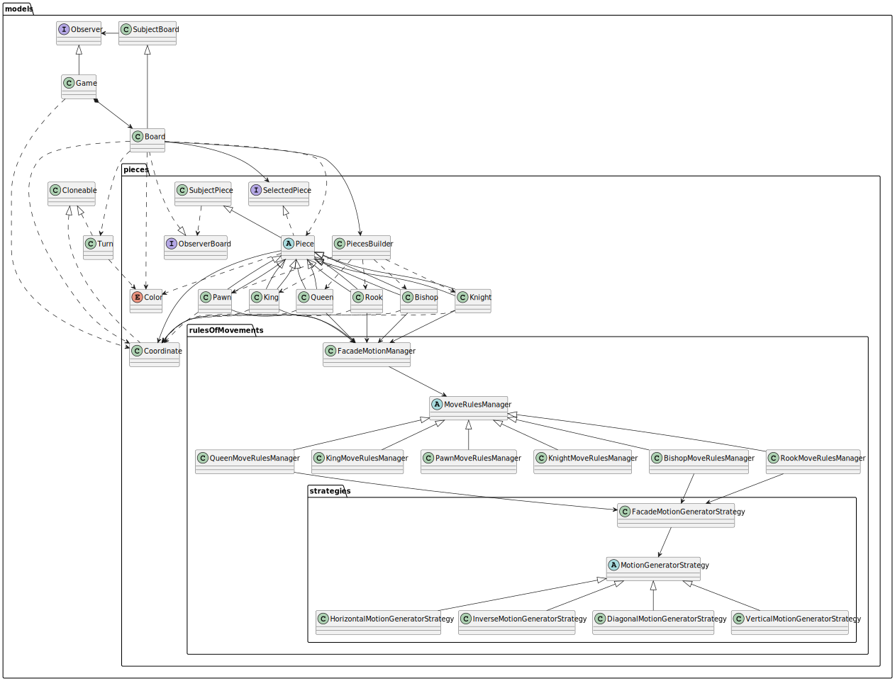

# Proyecto: Juego de Ajedrez y Principios de Diseño de Software

Este proyecto explora la implementación del juego de ajedrez como medio para enseñar y demostrar los principios 
fundamentales del diseño de software. Utiliza conceptos de diseño orientado a objetos y principios de diseño, para crear un sistema modular, escalable y fácil de mantener.

## Objetivos del Proyecto

- Demostrar cómo aplicar los **principios de diseño de software** en un contexto práctico.
- Implementar un diseño modular que permita añadir nuevas funcionalidades sin afectar el código existente.
- Desarrollar un sistema de ajedrez funcional que sirva como ejemplo educativo.

## Características Principales

- **Arquitectura Extensible:**
  Cada pieza del ajedrez cuenta con su propio administrador de movimientos, siguiendo una jerarquía de clases bien estructurada.

- **Validación de Movimientos:**
  Se aplican reglas de ajedrez para validar movimientos según el estado del tablero y las piezas.

- **Fácil Mantenimiento:**
  Gracias a la separación de responsabilidades y un diseño modular, el proyecto es fácil de escalar y modificar.

- **Código Educativo:**
  Es ideal para estudiantes y desarrolladores que buscan entender los principios de diseño orientado a objetos y cómo aplicarlos.

## Estructura del Proyecto

El proyecto está organizado de la siguiente manera:


## Indice

1. Instalación
2. Diagramas de Paquetes
3. Diagramas de Clases
4. Diagramas de Estado
5. Diagramas de Actividades

## Instalación

1. Clona el repositorio:
    ```bach
   git clone https://github.com/pcarroza/chess-java.git

## Diagrama de Estado


## Diagrama de Paquetes

1. Diagrama de Paquetes Completo


## Diagrama de Clases

Este diagrama de clases ofrece una representación general de los modelos y sus relaciones dentro del sistema de 
ajedrez. Cada clase está diseñada para cumplir un rol específico, respetando principios de diseño como el principio de 
separación de interfaces (ISP) y el principio de responsabilidad única (SRP). Además, incorpora patrones de diseño como 
Observador, Fachada, y Estrategia, para garantizar un sistema modular, extensible y fácilmente mantenible.

### Digrama de Clases General de los Modelos



### Jerarquía y Estructura

#### Clases Principales
- **Board**: Actúa como el núcleo del sistema, gestionando el estado 
del tablero y las piezas. Está estrechamente vinculada con las clases `Game` (para gestionar el flujo del juego) y 
Turn` (para rastrear el turno actual).
- **Piece**: Clase abstracta que sirve como base para todas las piezas del ajedrez (`Pawn`, `King`, `Queen`, `Rook`, `
Bishop`, `Knight`). Cada clase que hereda de `Piece` encapsula las características y comportamientos específicos de su tipo.

#### Gestores de Movimiento
- **MoveRulesManager**: Clase abstracta que define la lógica base para el movimiento de las piezas. 
Cada tipo de pieza tiene su propio gestor de movimientos (`KingMoveRulesManager`, `KnightMoveRulesManager`,
  `QueenMoveRulesManager`, `BishopMoveRulesManager`, `PawnMoveRulesManager`), 
asegurando que las reglas de movimiento sean específicas para cada pieza.
- El patrón de herencia en los gestores de movimiento permite una separación clara de responsabilidades y facilita la extensión de las reglas.

#### Estrategias Generadoras de Movimientos
- Dentro del paquete `strategies`, el sistema utiliza el **Patrón Estrategia** para definir cómo se generan los movimientos:
    - **MotionGeneratorStrategy**: Clase base.
    - Implementaciones concretas como `HorizontalMotionGeneratorStrategy`, `DiagonalMotionGeneratorStrategy` y `
  VerticalMotionGeneratorStrategy` definen los movimientos válidos en diferentes direcciones.

#### Uso del Patrón Fachada
- La clase `FacadeMotionManager` actúa como una fachada que coordina entre diferentes gestores de movimiento y 
estrategias, simplificando la interacción con las piezas.

### Relaciones y Dependencias

#### Asociación y Agregación
- **Patrón Observador**: Las clases `SubjectBoard` y `ObserverBoard` implementan este patrón, permitiendo que el estado 
del tablero sea monitoreado por otras clases, como `Game`.

#### Composición
- **Coordinate**: Representa la posición de las piezas en el tablero y es fundamental en el cálculo de movimientos válidos.

#### Modularidad
- La estructura general promueve una alta cohesión entre clases relacionadas (por ejemplo, todas las estrategias están 
encapsuladas en el paquete `strategies`), lo que mejora la mantenibilidad del sistema.

### Principios de Diseño

1. **Principio de Abierto/Cerrado (OCP)**: El sistema permite agregar nuevas piezas o estrategias de movimiento 
sin modificar el código existente.
2. **Segregación de Interfaces (ISP)**: Se entrega al tablero (`Board`) únicamente las interfaces específicas 
necesarias, evitando exponer métodos innecesarios de `Piece`.
3. **Patrón Observador**: Las piezas (`SubjectPiece`) añaden observadores como el tablero (`Board`) para mantener 
la comunicación bidireccional entre ambos. Esto permite que las piezas notifiquen cambios al tablero y viceversa.
4. **Uso de Patrones de Diseño**:
    - **Estrategia**: Para gestionar los movimientos de las piezas de manera flexible y extensible.
    - **Fachada**: Para simplificar la interacción con los gestores de movimiento y estrategias.
    - **Observador**: Para mantener sincronización entre las piezas y el tablero.


### Diagrama de clase particular de los modelos


